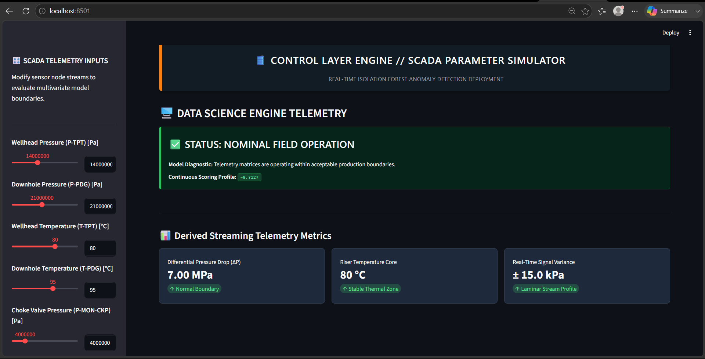
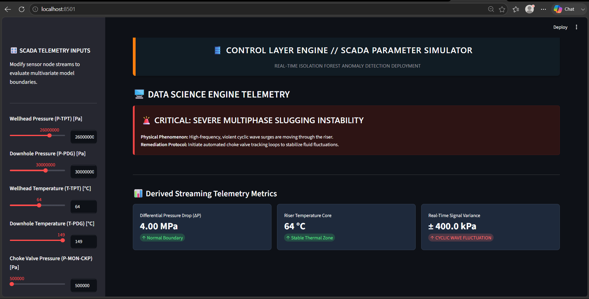
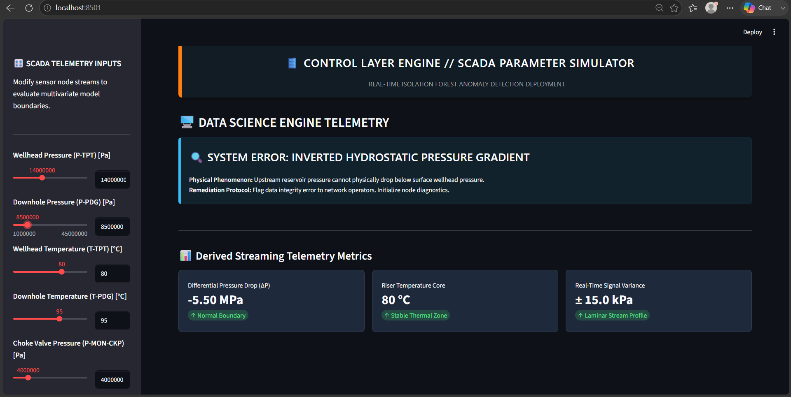
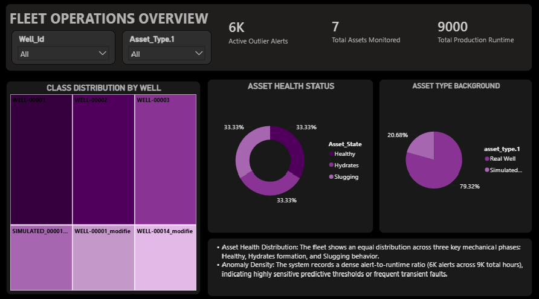
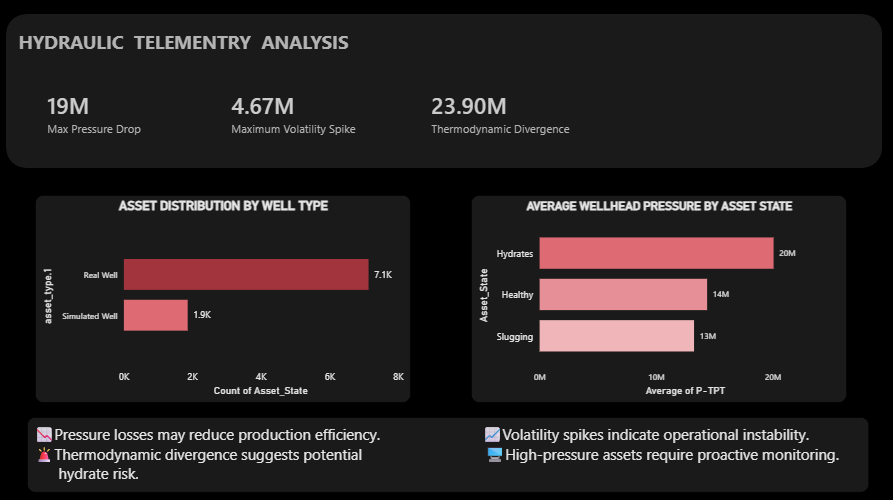
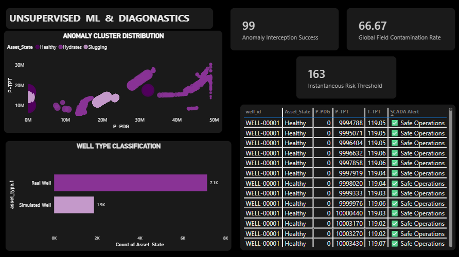
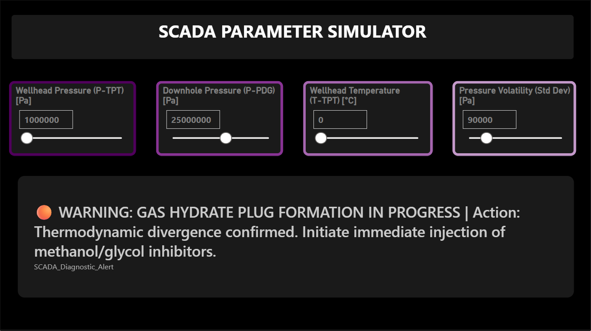

Predictive Maintenance Analysis using Machine Learning

📝Overview

Oil & gas production systems generate thousands of telemetry signals every day, making it difficult to manually identify abnormal operating conditions before they impact production. This project develops an end-to-end Predictive Maintenance and Industrial Anomaly Detection System using the 3W Oil & Gas Dataset. The solution combines Python, PostgreSQL, SQL analytics, Machine Learning, Power BI dashboards, and an interactive SCADA simulator to detect operational anomalies such as hydrate formation, severe slugging, pressure instability, and abnormal production behavior.

The primary objective is to support proactive maintenance decisions, reduce unplanned downtime, and improve asset reliability through data-driven monitoring and anomaly detection.

🚨Business Problem

Unexpected production anomalies can lead to:

📉 Reduced production efficiency
📉 Equipment degradation
📈 Increased maintenance costs
⚠️ Operational instability
🚨Safety risks in field operations

Traditional monitoring systems often identify problems only after production has already been affected. This project aims to detect abnormal operating conditions early by leveraging historical telemetry data and unsupervised machine learning techniques.

📂Dataset

The project uses the  Oil & Gas Dataset, containing telemetry records from three major operational states:

🟢Healthy Operations: Represents normal production behavior and serves as the baseline for comparison.

🟡Hydrate Formation Conditions: Represents flow assurance issues caused by hydrate accumulation, resulting in pressure-temperature abnormalities.

🟠 Severe Slugging Conditions: Represents unstable multiphase flow behavior characterized by large pressure fluctuations and production instability.

📝Project Workflow

⚙️ 1. Data Engineering & Preprocessing

The raw telemetry data was processed and consolidated before analysis.

 Tasks Performed:

* Combined multiple well telemetry files into master datasets.
* Standardized Healthy, Hydrate, and Slugging operating conditions.
* Created asset classifications (Real Well vs Simulated Well).
* Performed data cleaning and quality validation.
* Conducted Exploratory Data Analysis (EDA).
* Generated summary statistics and correlation analysis.
* Investigated pressure and temperature distributions across operating states.

🔍 2. Advanced SQL Analytics:

A dedicated SQL analytics layer was developed to investigate operational behavior and anomaly patterns.

🟡Healthy Operating Baseline Analysis: Established normal pressure and temperature ranges for healthy wells, creating reference benchmarks for anomaly detection.

🟠Pressure Volatility Monitoring: Measured rolling pressure fluctuations to identify instability associated with severe slugging conditions.

🔴Hydrate Thermodynamic Divergence Analysis: Analyzed pressure-temperature relationships to identify potential hydrate formation risks.

🔀Cross-Condition Pressure Audit: Compared healthy and abnormal operating states to quantify pressure surges and production instability.

📊Real vs Simulated Asset Vulnerability Assessment: Evaluated differences in anomaly behavior across real production wells and simulated assets.

🚨Statistical Z-Score Anomaly Detection: Implemented statistical anomaly detection techniques to identify readings that significantly deviated from healthy operating baselines.

❄️Thermal Fidelity Comparison: Compared temperature behavior across operating states to understand thermal changes during anomaly events.


💡 3. Machine Learning (Unsupervised Anomaly Detection):

🚨To move beyond static rules and traditional univariate alarms, a machine learning pipeline was engineered to map complex, multi-sensor behavioral patterns and catch hidden multivariate anomalies before they reach critical failure thresholds.

📂Ultra-Robust Directory Reader & Data Ingestion: Engineered a custom Python data parser (ingest_and_engineer_3w_folder) to intelligently scan, validate, and merge nested .csv sensor logs. This layer dynamically balances the dataset by selecting 1 simulated well log for every 2 real production logs, compiling a massive testing validation matrix of 515,026 rows.

⌛High-Dimensional Feature Engineering: Constructed a 9-dimensional telemetry matrix. Beyond raw pressure and temperature metrics (P-PDG, T-PDG, P-TPT, T-TPT, P-MON-CKP), the pipeline calculates dynamic time-series features. Using pandas .rolling().std() and .diff(), it tracks Pressure Volatility (30-period window) and Thermal/Choke Pressure Trends (60-period window) to capture structural data drift and fluid instability over time.

🌲Algorithmic Selection (Isolation Forest): Leveraged a scikit-learn Isolation Forest model to efficiently partition the high-dimensional SCADA data. Rather than profiling "normal" behavior, the model isolates distinct outliers. It was strictly fit on a "Folder 0 Baseline" (17,874 rows of nominal flow) to establish the safe operational envelope.

🔢Hyperparameter Grid Search Optimization: Executed a contamination threshold optimization loop (testing bounds from 0.01 to 0.08). The pipeline visualizes the tradeoff between Precision (False Alarm Protection) and Recall (Failure Interception Rate) to identify the global F1-Score optima, ensuring the model is mathematically tuned for control room deployment.

✅Continuous Density Scoring: Instead of binary "pass/fail" outputs, the model calculates a continuous anomaly density score (.score_samples()). This outputs a raw outlier severity metric (scaling ROC-AUC performance) that allows operators to define custom risk thresholds.


🎛️ 4. Live SCADA Simulator (Streamlit):

 

🖥️Deployed a real-time, interactive edge-computing application (app_simulated.py) to demonstrate the live deployment of the ML engine within a simulated control-room environment.

🚨Enterprise-Grade Industrial UI: Engineered with custom global CSS injection to create a low-luminance, high-contrast dark theme (#1E293B). This mimics actual SCADA HMI (Human-Machine Interface) environments, reducing operator eye strain while ensuring critical alert containers pop visually.

🖥️Synchronized Telemetry Controls: Features a high-fidelity control panel using Session State-synced dual inputs. Operators can quickly drag sliders to simulate rapid system drift, or type precise engineering values into numeric text boxes—matching the exact workflows used by subsea production engineers.

⌛Real-Time ML Inference Engine: On every user interaction, the dashboard compiles the 9 parameters into a live Pandas DataFrame and runs instantaneous inference against the serialized machine learning pipeline (.pkl), recalculating the spatial boundary score in milliseconds.

🔍Deterministic Root-Cause Classification: The diagnostic layer evaluates the ML output against physical thermodynamic and hydraulic boundaries to generate specific, actionable alerts:

 🚨 Severe Multiphase Slugging Instability: Triggers a crimson alert when high-frequency cyclic wave pressure variance is intercepted.

 

 🟠 Thermodynamic Gas Hydrate Formation: Triggers an amber alert when severe sub-cooling temperatures intersect with massive differential pressure drops.

  

 🔍 Hardware Transceiver Failure: Instantly catches impossible physical states (e.g., inverted hydrostatic gradients where downhole pressure reads lower than    surface pressure).


📊 5.Power BI Dashboards :
A dashboard was developed to monitor asset health, telemetry behavior, and machine learning outputs.

✅Fleet Operations Overview




This page provides a high-level summary of fleet performance and asset health.

* The system monitored 7 production assets across multiple operating conditions.
* Over 6,000 anomalous observations were detected across approximately 9,000 runtime hours.
* Asset health distribution was balanced across Healthy, Hydrate, and Slugging conditions (33.3% each).
* Real wells represented 79.32% of observations, while simulated wells contributed 20.68%.
* The high alert volume highlights the importance of continuous anomaly monitoring in production systems.

✅Hydraulic Telemetry Analysis



This page focuses on pressure behavior and flow assurance monitor 

* Pressure drops reached 19 million Pa, indicating significant production inefficiencies during abnormal operating conditions.
* Pressure volatility peaked at 4.67 million, confirming severe instability during slugging events.
* Thermodynamic divergence reached 23.9 million, suggesting strong pressure-temperature imbalances associated with hydrate formation.
* Real wells contributed approximately 7.1K observations, compared to 1.9K observations from simulated wells.
* Hydrate conditions recorded the highest average wellhead pressure (20M Pa), followed by Healthy (14M Pa) and Slugging (13M Pa) states.
* Pressure volatility and thermodynamic divergence emerged as strong indicators of abnormal operating behavior.

🔍Unsupervised ML Diagnostics



This page visualizes anomaly detection outputs generated by the Isolation Forest model.


* Isolation Forest successfully separated telemetry observations into distinct anomaly clusters.
* Healthy, Hydrate, and Slugging conditions formed visibly different operational regions within the anomaly space.
* A risk threshold score of 163 was established to prioritize operational events requiring investigation.
* The real-time SCADA alert table provides continuous monitoring of asset conditions.
* Most healthy observations were classified as Safe Operations, while abnormal telemetry combinations triggered anomaly alerts.

🔍Scada Parameter Simulator



This page visualizes affect of different parameters and what it can lead to

*It uses SCADA.
*Uses Isolation to detect the anomaly.
*Healthy, Hydrate, and Slugging are the outputs it shows.
*It also suggests the immediate action to take incase of Anomaly occurance.


⚙️ Tools & Technologies

* Python
* Pandas
* NumPy
* PostgreSQL
* SQL
* Scikit-Learn
* Isolation Forest
* Power BI
* Streamlit
* Git & GitHub


🚀 Getting Started

📂1. Clone the repository

```bash
git clone https://github.com/Project-Our-s/Predictive-Maintenance-Analysis-in-Petroleum-using-ML.git
cd Predictive-Maintenance-Analysis-in-Petroleum-using-ML
```

🖥️2. Install dependencies

```bash
pip install -r requirements.txt
```

✅3. Launch the SCADA Simulator

```bash
 python -m streamlit run app_simulator.py
```

